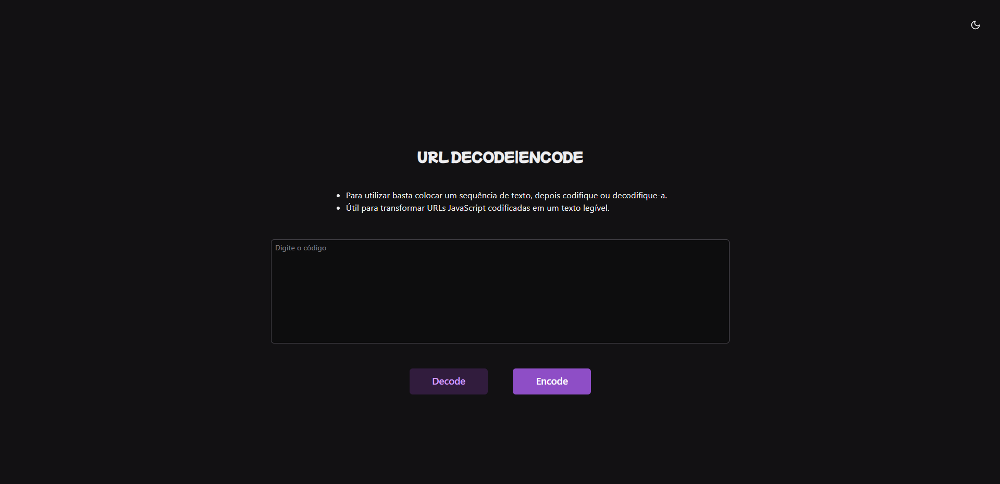

# URL Decode Encode

Simples aplicação de encode e decode de URLs desenvolvida totalmente em Python puro, usando a biblioteca Reflex.

## O que é Reflex?

A descrição que é colocada no próprio site diz:

>"O Reflex é uma estrutura Python full-stack de código aberto que facilita a criação e a implantação de aplicativos da Web em minutos. Ele oferece a facilidade de uso e acessibilidade de estruturas low-code, combinadas com a flexibilidade, desempenho e personalização do desenvolvimento web tradicional. O Reflex foi projetado para ser fácil de começar para aqueles sem experiência anterior em desenvolvimento web."

É uma ótima opção para dar um visual à aplicação Python, tornando-a acessível para o público em geral e não dependendo somente de comandos via terminal ou de um executável.

Para conferir a aplicação, acesse: [Url Decode Encode](https://url-decode-encode.reflex.run/).